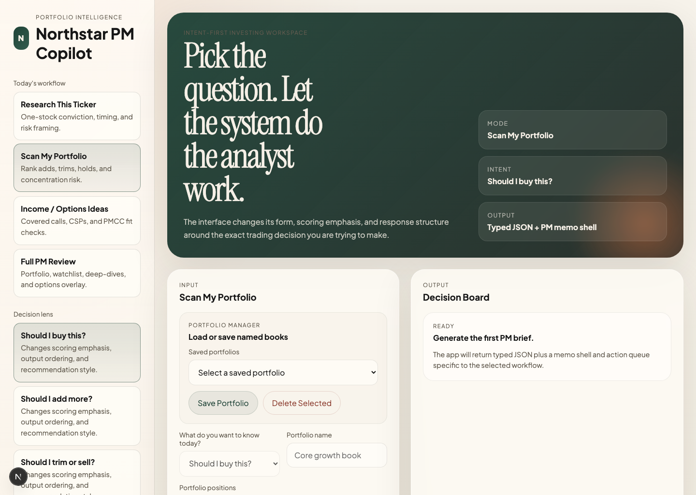
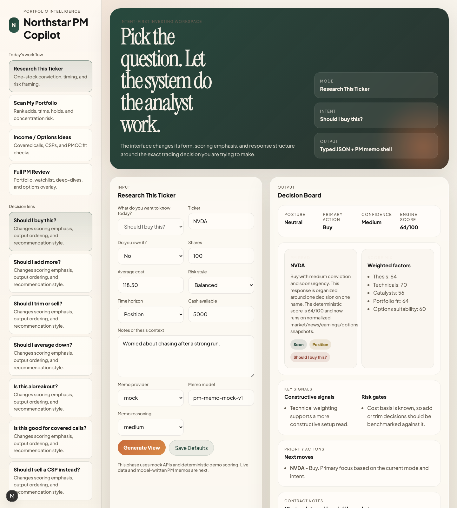

# WealthPilot

Selector-first Next.js app for a hedge-fund-style stock, portfolio, and options decision workspace.

## What this build does

- Lets the user choose a primary workflow:
  - `Research This Ticker`
  - `Scan My Portfolio`
  - `Income / Options Ideas`
  - `Full PM Review`
- Lets the user choose a decision intent:
  - buy
  - add
  - trim/sell
  - average down
  - breakout
  - covered call
  - CSP
- Adapts the input form, recommendation emphasis, and generated Codex prompt.
- Serves normalized analysis JSON from Next.js API routes with request validation.
- Produces a lightweight decision board and a configurable PM memo layer with `mock`, `openai`, and `openai-compatible` provider options.

## Screenshots

## Key folders

- `app/` — App Router pages, global styles, and API routes
- `components/` — layout, selectors, forms, and results UI
- `lib/` — mode config, schemas, scoring modules, and server helpers
- `lib/data/` — normalized snapshot types, provider adapters, cache, and composed data service
- `lib/ai/` — provider-agnostic memo generation, prompt building, and LLM adapters
- `lib/server/` — shared request validation and route response helpers
- `db/` — local file-backed persistence for profile, portfolios, and history
- `PLAN.md` — implementation roadmap

## Run

1. Install dependencies: `npm install`
2. Start dev server: `npm run dev`

## Environment

Copy `.env.local.example` to `.env.local` and configure the providers you want to use.

- `OPENAI_API_KEY` for OpenAI
- `LLM_API_KEY` and `LLM_BASE_URL` for OpenAI-compatible vendors or gateways
- `ALPHA_VANTAGE_API_KEY` for live market, news, earnings, and options adapters
- `DATA_PROVIDER=mock` to force mock adapters even when live keys exist
- `ALPHA_VANTAGE_BASE_URL` only if you need to override the default API host

## Persistence

The app now stores local state under `db/storage/`:

- profile defaults
- saved portfolios
- recent analysis history

Portfolio and full-review runs can be saved by providing a portfolio name. Analysis runs are saved automatically.

## Next build step

1. Add an additional live provider path beyond Alpha Vantage so options data is not dependent on a premium-only endpoint.
2. Add more LLM vendor adapters beyond the current OpenAI-compatible path.
3. Persist saved portfolios, user defaults, and analysis history.

## Quick Repo Summary

- Purpose: Selector-first Next.js app for a hedge-fund-style stock, portfolio, and options decision workspace.
- Stack: Node.js, Next.js, React, TypeScript, CSS, JavaScript
- Status confidence: high
- Pending: unknown from current repo docs

## LLM Start Here
- `README.md`
- `graphify-out/GRAPH_REPORT.md`
- `Plan.md`
- `PLAN.md`
- `graphify-out/repo-semantic-summary.md`

## License

This repository is proprietary and released under [All Rights Reserved](LICENSE).
